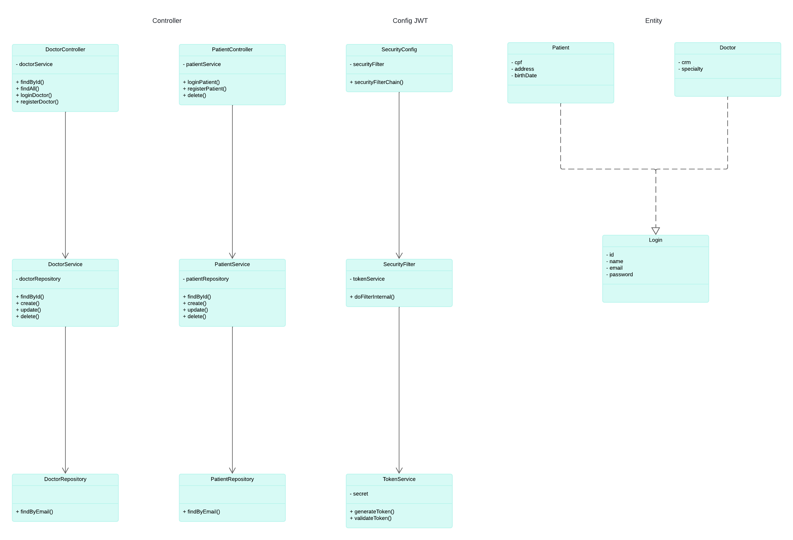

## Desafio: Sistema de Gestão de Hospital
### Descrição do Projeto
- Você foi contratado para desenvolver um sistema de gestão hospitalar. O sistema deve permitir que os administradores do hospital gerenciem pacientes, médicos, consultas, prontuários médicos e faturamento. Além disso, deve haver um portal para pacientes e médicos acessarem informações relevantes. O sistema deve incluir autenticação e autorização robustas, utilizando JWT para proteger endpoints e gerenciar sessões de usuários. Deve também permitir a criação, atualização e remoção de registros de médicos e pacientes, além de fornecer funcionalidades para agendamento de consultas e acesso a prontuários médicos. 
## Requisitos
- [X] Cadastro e Login de Usuários: Pacientes e médicos devem poder se registrar e fazer login no sistema.
- [X] Gestão de Pacientes: Administradores devem poder adicionar, atualizar e remover informações de pacientes.
- [ ] Gestão de Médicos: Administradores devem poder adicionar, atualizar e remover informações de médicos.
- [ ] Agendamento de Consultas: Pacientes devem poder agendar consultas com médicos disponíveis.
- [ ] Prontuários Médicos: Médicos devem poder acessar e atualizar prontuários médicos dos pacientes.
- [ ] Portal do Paciente: Pacientes devem poder visualizar suas consultas agendadas, prontuários médicos e histórico de pagamentos.
- [ ] Portal do Médico: Médicos devem poder visualizar suas consultas agendadas e prontuários dos pacientes.
## Opcionais
- [ ] Faturamento: O sistema deve gerar faturas para consultas e tratamentos, permitindo que os administradores acompanhem pagamentos.
- [ ] Notificações: O sistema deve enviar notificações por email ou SMS para lembrar os pacientes sobre consultas agendadas.
- [ ] Relatórios: O sistema deve gerar relatórios detalhados sobre consultas, pacientes e médicos.
- [ ] Integração com APIs de Pagamento: Considere integrar com APIs de pagamento para processar transações de faturamento.
- [ ] Feedback de Pacientes: Permitir que pacientes deixem feedback sobre suas consultas e médicos.
- [ ] Histórico de Consultas: Médicos e pacientes devem poder acessar o histórico completo de consultas realizadas.
### Dicas
- Persistência de Dados: Utilize um banco de dados relacional (como MySQL ou PostgreSQL) para armazenar informações sobre pacientes, médicos e consultas.
- Frameworks: Use Spring Boot para acelerar o desenvolvimento e facilitar a configuração do projeto.
- Segurança: Implemente autenticação e autorização utilizando Spring Security.
- Testes: Escreva testes unitários e de integração para garantir a qualidade do código.
- Documentação: Documente sua API utilizando Swagger ou outra ferramenta similar.
## Tecnologias Sugeridas
- Java 11+
- Spring Boot
- Spring Security
- JPA/Hibernate
- MySQL/PostgreSQL
- JUnit/Mockito
- Swagger

## Diagrama

